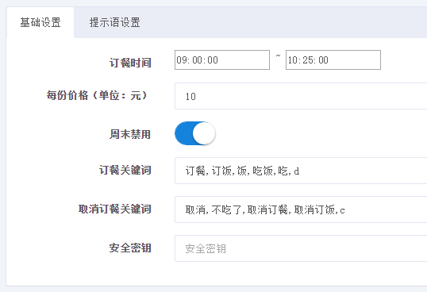
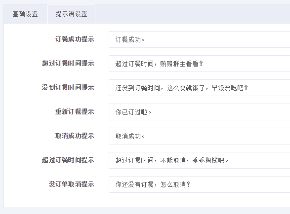
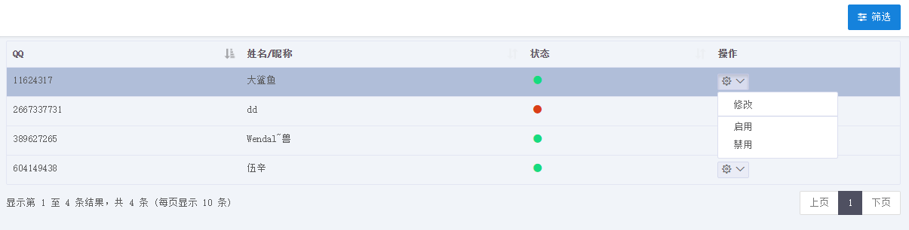
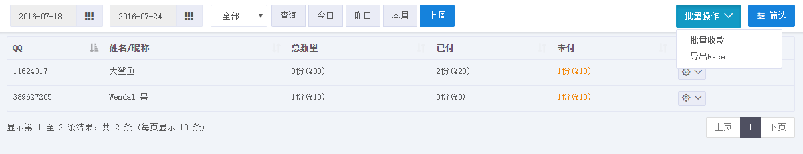

公司群订餐小系统
=========
基于 NutzWk 3.x 和 QQ机器人实现的

1、订餐配置

2、用户管理

3、订单管理

使用说明
=========
1、需配合“第五代QQ机器人”使用

2、配置接收地址：http://127.0.0.1/open/robot/msg

3、将设定的QQ拉入群

4、服务端管理地址：http://127.0.0.1/private/login

5、管理员帐号：superadmin  密码：1

