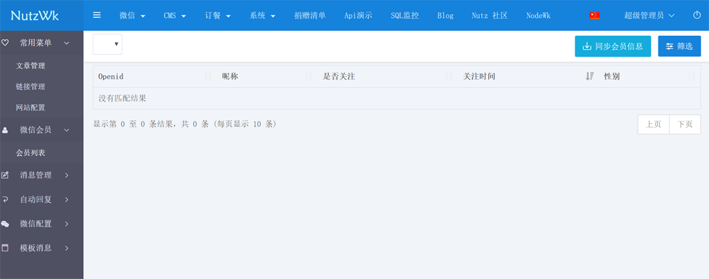

NutzWk 基于Nutz的开源企业级开发框架
======

在线演示地址
======
https://nutzwk.wizzer.cn/                 NutzWk v3.x、v4.x、v5.x

https://vue.wizzer.cn                     NutzWk v3.x-vue

# 版本说明

*   NutzWk v5.x 微服务版本(分支名:[nutzboot-dubbo](https://github.com/Wizzercn/NutzWk/tree/nutzboot-dubbo),微服务dubbo分布式版本)
*   NutzWk v4.x 模块化版本(分支名:[modular](https://github.com/Wizzercn/NutzWk/tree/modular),统一提供代码生成器及IDEA可视化插件)
*   NutzWk v3.x 单应用版本(分支名:[bootstrap-3.3.x](https://github.com/Wizzercn/NutzWk/tree/bootstrap-3.3.x),CMS+微信+系统+权限+常用功能封装 beetl/velocity)
*   NutzWk v1.0 传统版(分支名:[master](https://github.com/Wizzercn/NutzWk/tree/master),velocity 支持IE6)

# 本版说明(v5.x)

## NutzWk 5.x 运行必备环境：

*   JDK 8 162 + 
*   Maven 3.5.3 +
*   Redis 4.0.8 +
*   MySql 5.6 +
*   Zookeeper 3.4.11 +

## NutzWk 5.x 技术选型：

*   核心框架：Nutz、Nutz MVC、Nutz Dao、Nutzboot
*   分布式框架：Dubbo、Zookeeper
*   安全框架：Shiro
*   任务调度：Quartz
*   数据库连接池：Druid 
*   支持数据库：MySql、Oracle、SqlServer、达梦等
*   缓存框架：Redis、Ehcache、Wkcache
*   订阅发布：Redis
*   可扩展功能：WebSocket-Nutz、消息队列-Rabbitmq、搜索引擎-Elasticsearch、工作流-Activiti等
*   前端框架：Bootstrap+JQuery

## NutzWk 5.x 使用说明：

| 名称                                     | 介绍                                     |
| ---------------------------------------- | ---------------------------------------- |
|[wk-framework](wk-framework) |一些基类及公共方法的封装|
|[wk-model](wk-app/wk-model) |POJO类|
|[wk-common](wk-app/wk-common) |接口类|
|[wk-nb-service-sys](wk-app/wk-nb-service-sys) |系统管理模块,dubbo服务端,NB项目,权限体系|
|[wk-nb-service-cms](wk-app/wk-nb-service-cms) |CMS管理模块,dubbo服务端,NB项目,ig及wkcache演示|
|[wk-nb-service-wx](wk-app/wk-nb-service-wx) |微信管理模块,dubbo服务端,NB项目,微信及微信支付功能演示|
|[wk-nb-task](wk-app/wk-nb-task) |定时任务模块,dubbo服务端,NB项目,支持quartz集群|
|[wk-nb-web-platform](wk-app/wk-nb-web-platform) |WEB管理后台模块,dubbo消费端,NB项目,Mvc|

*   确保 MySql、Redis、Zookeeper 默认配置并已启动好
*   MySql 创建名为 nutzwk_nb 的空数据库,在每个NB项目启动时会自动建表,同时初始化数据
*   wk-nb-service-sys为第一启动项目,然后启动其他NB项目,最后启动wk-nb-web-platform
*   运行参数 -Dnutz.profiles.active=prod 可让NB项目加载 application-prod.properties 配置文件
*   正常启动后访问 http://127.0.0.1:8080/sysadmin 用户名 superadmin 密码 1

# 鸣谢
*   [@wendal](https://github.com/wendal) (代码贡献者,技术大牛,Nutz主要作者,无所不知且乐于助人)
*   [@rekoe](https://github.com/Rekoe) (代码贡献者)
*   [@enilu](https://github.com/enilu) (代码生成器及IDEA插件贡献者)
*   [@loyalove](https://github.com/loyalove) (Vue代码贡献者)
*   [@threefish](https://github.com/threefish) (控制类快速定位模板页面IDEA插件贡献值)
*   以及交流群里热心的小伙伴们~
*    QQ交流群: 68428921

# 关于

*   本项目完全开源，商用完全免费
*   欢迎打赏，以资鼓励

