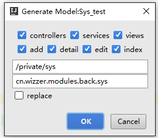
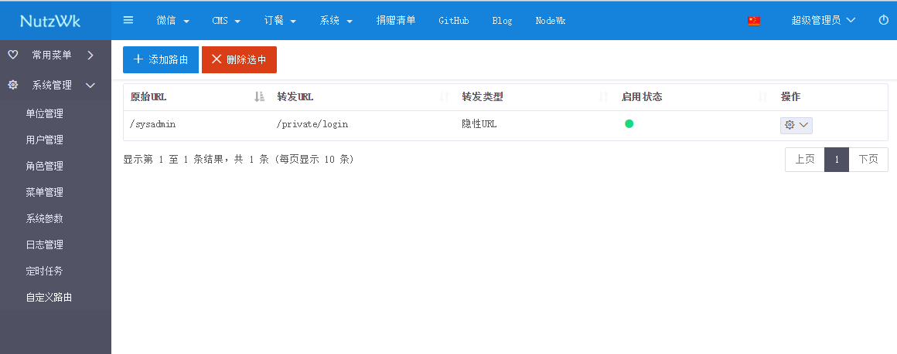

NutzWk 基于Nutz的开源企业级开发框架 
======

开发计划:

* NutzWk 4.0.x   前后端分离版 (vue + nutz + dubbo) **开发中..**
* NutzWk 3.3.x   CMS+微信+系统+权限+常用功能封装 (beetl / beetl+velocity)
* NutzWk 2.0.x   试验版(不建议使用)
* NutzWk 1.0.x   传统版(velocity 支持IE6)

注:_velocity后缀为同时支持beetl和velocity两种模板引擎版本  

QQ交流群: 68428921

在线演示地址
======
https://nutzwk.wizzer.cn/                 NutzWk v3.x

https://vue.wizzer.cn                     NutzWk v4.x

https://github.com/Wizzercn/NodeWk       Node.js版源码

======
基于Nutz的开源企业级开发框架

NutzWk 3.x 运行环境：
*   JDK 8
*   Tomcat 8.x +
*   Maven 3.3.x +

NutzWk 3.x 新特性：
*   集成Shiro权限框架
*   集成Ehcache缓存
*   集成Redis
*   支持语言国际化
*   支持注解式事务
*   支持动作链
*   支持注解式日志
*   支持自定义路由
*   支持插件热插拔
*   支持API Token及应用管理
*   集成Email服务
*   集成Quartz定时任务
*   集成Lucene搜索引擎
*   集成Beetl/Velocity模板引擎
*   后台管理界面采用Pjax+Bootstrap

使用说明：
*   创建空的数据库
*   修改数据库连接 /resources/config/custom/db.properties
*   项目使用Maven构建，IDEA/Eclipse直接打开，等待包下载完毕
*   启动时自动建表
*   http://127.0.0.1/sysadmin
*   用户名：superadmin  密码：1

代码生成器【IDEA插件】
======

**IDEA插件搜 nutzwk-plugin **

IDEA - Code - Generate - nutzwk mvc

https://github.com/enilu/nutzwk-code-generator              适用于NutzWk v3.x

*  nutzwk-plugin 插件是通过 nutzwk-code-generator 实现的，感谢@enilu 的贡献
*  v3.2.2 以后版本 nutzwk-code-generator 直接集成到框架中

代码生成器【图形界面】
======

https://github.com/Wizzercn/NutzCodematic/tree/v3.3.0       适用于NutzWk v3.3.0

https://github.com/Wizzercn/NutzCodematic/tree/v3.0.0       适用于NutzWk v3.0.0 ~ v3.2.7

https://github.com/Wizzercn/NutzCodematic/tree/v1.0.0       适用于NutzWk 1.0

老版本说明
======

NutzWk 1.0 源码是这个链接： https://github.com/Wizzercn/NutzWk/tree/1.0

NutzWk 1.0 含Activiti工作流的源码在这里： https://github.com/wendal/wzflow

NutzWk v3.x 运行截图
======

捐助开发者
======
如果你是企业经营者，那么赞助 NutzWk 有商业上的益处：可以让你的产品保持健康并得到积极的维护。 

如果你是个人开发者并且享受 NutzWk 带来的高开发效率，可以赠送一杯咖啡以资鼓励~~

[支付宝收款二维码](alipay.jpg)

捐赠清单：https://nutzwk.wizzer.cn/private/pm/info
