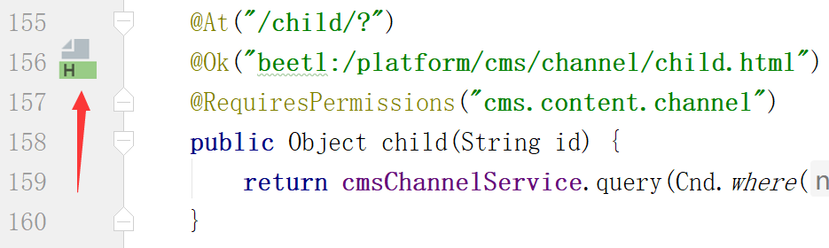

#IDEA控制类快速定位模板页面插件

在控制类点击 @Ok 前面的图标即可快速打开或切换至html模板文件

#安装

Settings --> Plugins --> Install plugin from disk --> NutzCodeInsight.jar

#源码

原作者: @threefish

https://github.com/threefish/NutzCodeInsight

#Demo

 