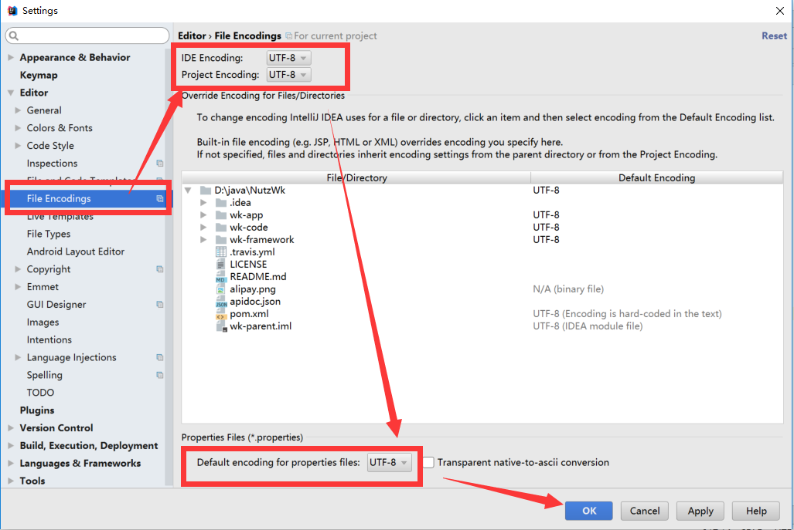
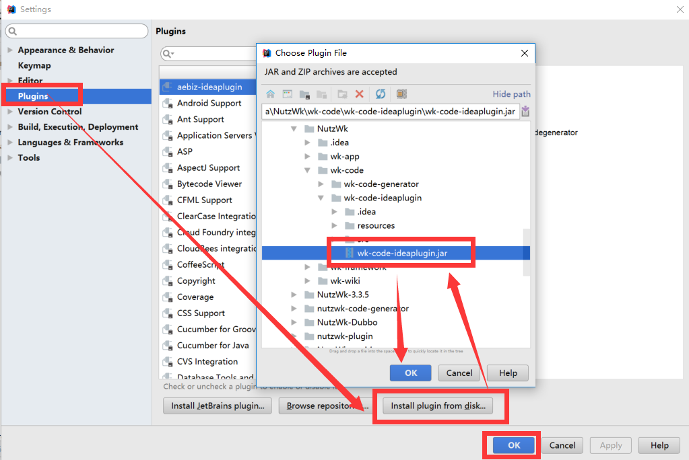

## 运行环境`必须`

* JDK 1.8.171 以上

* Maven 3.5.x 以上

* Redis 3.2.x 以上

* Zookeeper 3.4.x 以上

* MySQL 5.6 以上或 Oracle 、SqlServer 等数据库

## IDEA构建

* 系统环境变量配好JDK_HOME、MAVEN_HOME，注意你的Maven配置，看这里的[特别提醒](http://nutzam.com/core/basic/maven.html)

* IDEA --> File --> Open ，选择项目所在文件件夹，是“Open项目”，而非导入项目！！是“Open项目”，而非导入项目！！是“Open项目”，而非导入项目！！

* IDEA 打开项目后会自动下载jar包构建项目，等待构建完成

## IDEA配置

File > Settings > File Encodings > All UTF-8

##  安装代码生成器插件`可选`

File > Plugins > Install plugin from disk 

代码生成器的使用后面章节会介绍

选择代码生成器插件 wk-code-ideaplugin-nb.jar 进行安装，安装成功后会提示重启IDEA，请重启IDEA

