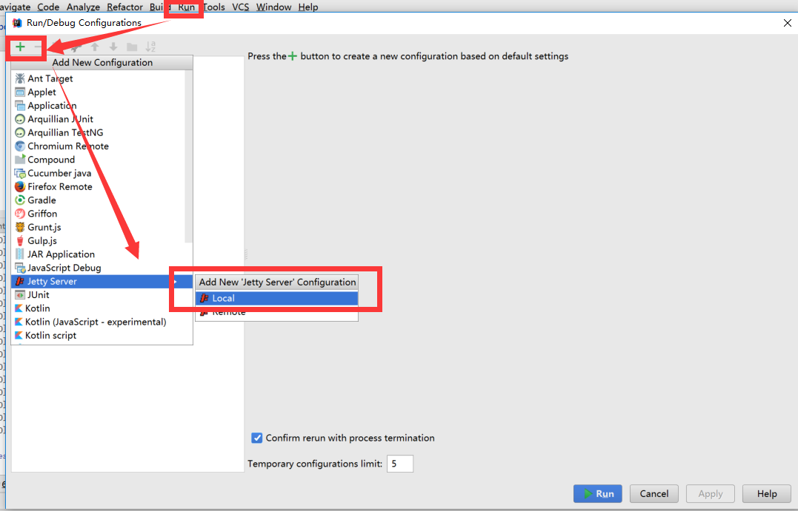
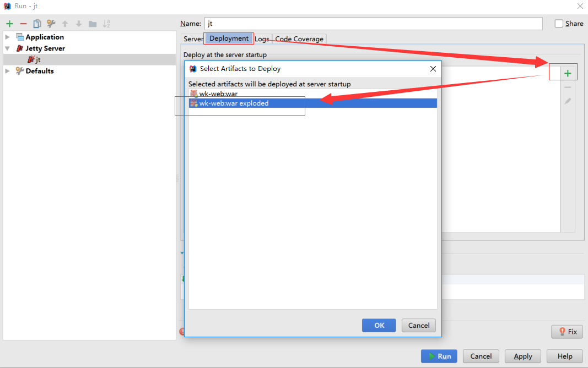
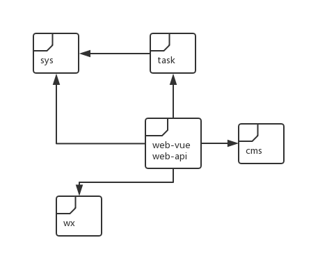

# 方法一：Maven启动

CMD命令行

* 项目根目录 > mvn install

* wk-web > mvn jetty:run

* 访问地址 http://127.0.0.1:8080/sysadmin

* 用户名 superadmin 、密码 1   `登录页已默认填写`

* 若非mysql数据库,请修改quartz.properties 中org.quartz.jobStore.driverDelegateClass的值

# 方法二：IDEA配置启动

### Jetty 9.3以上

### Tomcat 8.0以上

