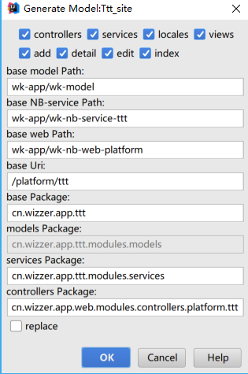

## 代码生成器

* IDEA Settings --> Plugins --> Install plugin from disk --> wk-code-ideaplugin-nb.jar [wk-code里面找]
* wk-model 创建model类,必须有@Table,若字段需输出到页面则需加 @Comment 字段备注(注意命名规范和大小写)
* 编译 model类,使其编译至 target/classes 目录下(目的是让代码生成器可读取到class文件)
* 在实体类里鼠标右击,或者IDEA Code --> Generate --> wk-nb mvc

