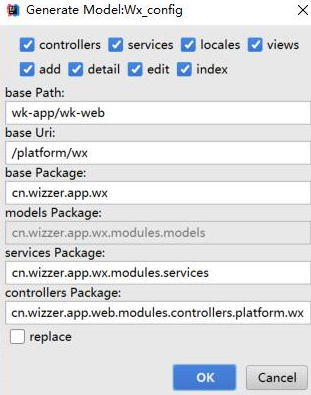

# 代码生成器
*   IDEA Settings --> Plugins --> Install plugin from disk --> wk-code-ideaplugin.jar
*   创建实体类,必须有@Table,若字段需生成到模板页面则需加 @Comment 字段备注
*   编译wk-web项目,使其打包发布至 target/ 目录
*   在实体类上鼠标右击,Code(Alt+Insert/Mouse Right) --> Generate --> wk mvc

